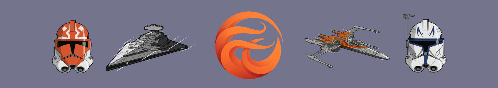

Drawing credits goes to : [Louis Davis](https://dribbble.com/lwdavisdesigns/)
# Hi curious profile viewer 👋

I'm Clément a 20yo guy passionate about Software Architecture, Programming, Star Wars and all their magic

### Some of my cool Projects
  - [Comsquare](https://github.com/AnonymusRaccoon/ComSquare), A C++ SNES Emultor
  - [Wanda-Vision](https://github.com/Octopus773/Wanda-Vision), Program capable of loading dynamic libraries with a high level of abstraction, in order to play arcade game (ie: Pacman)
  - [Lily](https://github.com/Octopus773/lily), An handy lib to manage linked lists in C (Epitech norm compliant)
  - [Forecasting village](https://github.com/AnonymusRaccoon/ForecastingVillage), An isometric RPG made in C using Gamacon.

### Main technos
  - C/C++
  - Python
  - ReactJS
  - PHP
  - x86 asm (yeah really)

### Want i want to do
  - Server experiments with my Raspberri PI
  - Deep Learning Stuff
  - Discover Rust

### ToDo list
  - [x] Create README.md
  - [ ] Work on the projects themselves
