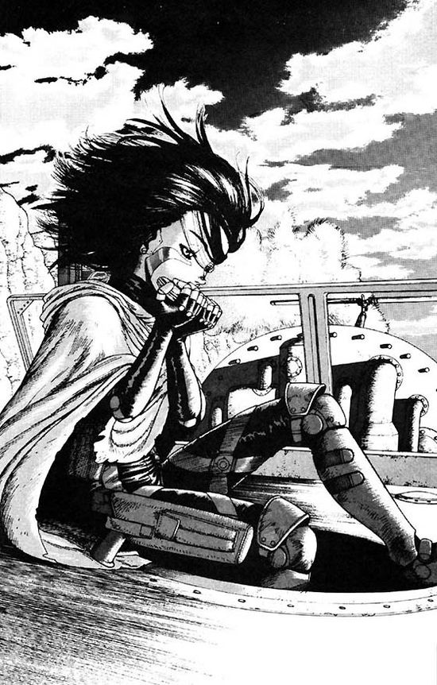

  

Source: GUNNM
# Hi curious profile viewer 👋

I'm Clément a 20yo guy passionate about Software Architecture, Programming, Star Wars and all their magic

### Some of my cool Projects
  - [Bomberman](https://github.com/AnonymusRaccoon/Bomberman), A complete bomberman game with heights, AI in lua, and shaders
  - [Comsquare](https://github.com/AnonymusRaccoon/ComSquare), A C++ SNES Emultor
  - [Wanda-Vision](https://github.com/Octopus773/Wanda-Vision), Program capable of loading dynamic libraries with a high level of abstraction, in order to play arcade game (ie: Pacman)
  - [Lily](https://github.com/Octopus773/lily), An handy lib to manage linked lists in C (Epitech norm compliant)

### Main technos
  - C++
  - C
  - Python
  - ReactJS
  - PHP
  - x86 asm (yeah really)

### Want i want to do
  - Server experiments with my Raspberri PI
  - Computer Vision
  - Coroutines
  - Implementing algorithms as a specialized mini lib

### Quick Stats

### ToDo list
  - [x] Create README.md
  - [ ] Work on the projects themselves
